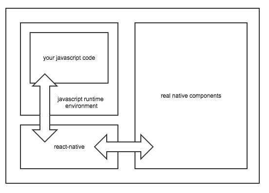
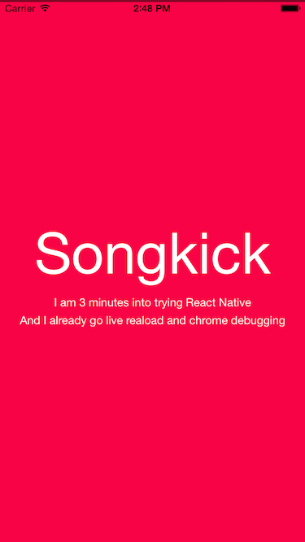
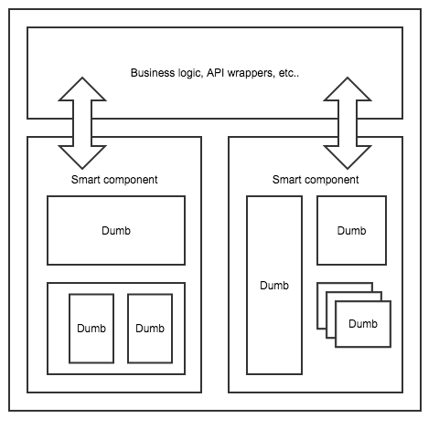
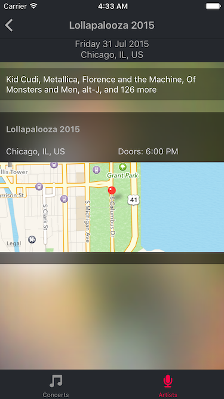

# Experimenting with React-Native

This summer, instead of enjoying the bright and warm London weather, my friend [@vjo](https://twitter.com/vjo) and I spent
a whole weekend experimenting with Facebook's [`react-native`](https://facebook.github.io/react-native/).

`react-native` is a technology that lets you write your iOS (Android under beta) application using javascript. Unlike other existing technologies such as [Apache cordova](https://cordova.apache.org/) or
[ionics](http://ionicframework.com/), you are not writing a hybrid application, ie. a web application wrapped into a native shell. Instead, your javascript code will be executed live in a javascript environment and will manipulate real native components. As you'll see in this article, this makes a tremendous difference.

## Objectives

In addition to avoiding any skin tanning, we had many reasons to spend the weekend in our workspace:

* Get some `react` experience
* See how seasoned web devs could steal mobile dev jobs
* Spot the technology's limitations and bugs
* Find a way to bypass the painful Apple review process
* Just the fun of it

## So, what's in the box?

### Setting up the project

New technologies, especially the ambitious ones, initially come with poor tooling and painful setup process. `react-native` isn't that kind. Setting up a new project, building it and running it in the simulator literally takes 3 minutes. All you need is [nodejs](https://nodejs.org/), which any webdev already has installed, and XCode (sorry Linux). There are only 4 steps:

1. Install react-native: `npm i -g react-native`
2. Use CLI to create the project: `react-native init`
3. Open the XCode project `open myproject.xcodeproj`
4. Press the "Play" button

Yup, that's it.

### Download the application code at runtime

Apple recently changed its conditions regarding application code download. While it is forbidden to download and run **native** code, you can do that with code running within the javascript environment.

*Why this difference?* Because this code is isolated and can't really do any arm.

*Why is that useful?* Because you can save a [~7 days](http://appreviewtimes.com/) delay on every app update. 7 days an unacceptable delay to any LEAN process, where [speed is a critical element of your success](https://en.wikipedia.org/wiki/Lean_startup#Build.E2.80.93Measure.E2.80.93Learn).

The simple way to package your app is to embed the compiled `app.jsbundle` file right into it. But, the clever way to do it is to host it on a CDN and make the app download it at runtime instead (saving the latest version for offline access).

That way, your app updates will belong to one of two kinds: the application native code updates, where you update the `react-native` library itself and any library embedding native code; or the javascript code-only updates.

The first one requires your application to go through the review process, fortunately, you don't need to do them frequently.

The second one, well, you can have as many per day as you want.

Oh, and by the way, if you want to automate the process and have the CI do the compile and CDN upload for you that is exactly [16 lines of config](https://github.com/ArnaudRinquin/sk-react-native/blob/master/circle.yml).

It took us 2 and a half hours to get this fully-automated, CI-baked, real-time app update process. This is a _huge_ step over the regular process.

### Writing the actual application code

At this point, we have an app, but it's empty. It's now time to do some actual development and lose this naive smile. Or not.

The code you write has two characteristics:

1. it's [JSX](https://facebook.github.io/react/docs/jsx-in-depth.html), a React specific superset of javascript that looks like HTML. The usual first reaction to JSX is a disgusted face, but you end up accepting and loving it (and anyway, it's optional).

2. it's [ES6](http://es6-features.org/#Constants), or even ES7 code. *What is ES6? Should I care?* ES6 is the newest version of the javascript language and APIs. Basically, the Rolls Royce of all the possible javascript environments any web dev dreams about. Your ES6 (or ES7 actually) code is compiled down to _regular_ javascript using [babel](https://babeljs.io/), the operation is transparent, fast and 100% reliable.

#### It's only React but for native apps

One of the promises of `react`, which was originally only created for the web, is: [_Learn Once, Write anywhere_](https://facebook.github.io/react/blog/2015/03/26/introducing-react-native.html) (in opposition of unachievable _Write Once, Run everywhere_).

Once you have understood the principles of `react`, writing a `react-native` application is not more difficult than a web one. Switch `div` for `View`, `span` for `Text` and you're good, basically.

The other good news is that this set of principles, while simple, is a mind-blowing step over more _classical / MVC_ way of building UIs. This topic deserves its own blog article but the essence of it is that your UI is a function of your application state and data: `react(data, state) => UI`. It lets you get rid of the giant spaghetti monstrosity any MVC application ultimately ends up being. More on this [here](http://jlongster.com/Removing-User-Interface-Complexity,-or-Why-React-is-Awesome), [here](https://facebook.github.io/react/docs/why-react.html) and [here](https://www.google.com/search?q=why%20react%20is%20awesome#q=reactjs+love).

### That developer dream feeling

If there is one thing native developers envy of web devs, it is the live-reload. With `react-native`, you'll get it. There is no need to kill the app, wait for compilation, and restart the app. While there is a compilation step (with babel), it is super fast and the application will just reload your javascript bundle. Without restarting. Sorry devs, no more [wheeled-chair-riding-sword-fighting](https://imgs.xkcd.com/comics/compiling.png).

Another great thing about web dev? The [Chrome Developer Tools](https://developers.google.com/web/tools/setup/workspace/setup-devtools). Yes, you can get that too. The way it works is amazing: your javascript actually runs within Chrome and send instructions to the native part of `react-native` using SocketIO. Clever.

You will also enjoy the FPS meter and element inspector:

### How do you do _X_? Can I do _Y_?

* _make API calls_: same way you'd do in a web app, using the [`fetch`](https://developer.mozilla.org/en-US/docs/Web/API/Fetch_API) api. All the regular HTTP options are available, headers, methods, etc. It took us no time to wrap the awesome [Songkick API](https://www.songkick.com/developer).
* _layout/style you application_: using a [subset](https://facebook.github.io/react-native/docs/style.html#content) of CSS, including `flex`.
* _persist data on the phone_: there is [an API](https://facebook.github.io/react-native/docs/asyncstorage.html#content) for that™, bridging some native API (you do not need to care about it).
* _access push notifications_: again, there is [an API](https://facebook.github.io/react-native/docs/pushnotificationios.html#content) for that
* _display a native map / date picker / you-name-it-component_: there are components wrapping almost every native one.
* _use this nice advanced blur effect_: simply use the open source [library](https://github.com/Kureev/react-native-blur)
* _I have developed my own fancy native component, how do I do?_ You simply write [the bridge](https://facebook.github.io/react-native/docs/native-components-ios.html#content) for it. It's actually pretty straightforward.

The rule of thumb: if your stuff is not accessible through the existing `react-native` wrappers, you can do it your self.

### Sharing code between platforms

This is something we did not actually do as we don't have an equivalent web application, but we know it is possible  to share most of your code between apps.

If you follow [Dan Abramov](https://github.com/gaearon)'s [_Smart and Dumb components_](https://medium.com/@dan_abramov/smart-and-dumb-components-7ca2f9a7c7d0) guidelines, most of the complexity of you application will be abstracted out of the view layer, hooked using usually thin _Smart_ components wrapping platform specific but simple _Dumb_ components.

While this schema does not really show it, most of the volume and complexity of your app is in the business logic part, not the _Dumb_ components, which form the only part of your app you are going to need to re-implement.

### Integration with an existing application

Another thing we haven't tried yet is the ability to integrate little bits of `react-native` into an existing native app. This is definitely possible and there are [guidelines](https://facebook.github.io/react-native/docs/embedded-app-ios.html#content) and [examples](https://github.com/tjwudi/EmbededReactNativeExample) for that.

This is probably the way to go if you already have one.

## The result

Here are a few screenshots of the application we had:

* at the end of a single weekend
* by two devs
* little experience with React
* with no Objectice-C or Swift knowledge
* while oversleeping and getting out to enjoy the evenings (that was not a _no-sleep-sweat-shop-hackathlon_ experience)

And here are some more after a few more extra hours:

What the screenshots don't show is the feeling. It's native. You really cant tell the difference, it runs at 60fps and is as reactive as any regular native app. No pun intended.

## The tl:dr; - or Conclusion

* this creates real **native** apps, not ugly hybrids
* incredibly fast and enjoyable development process
* share a lot code between platforms
* accessible to web devs (one-man-army compliant)
* you should not rewrite you existing app into `react-native` but integrate it where it makes sense
* probably the most important: skip the Apple review process and get huge speed increase
* Get [the code](https://github.com/ArnaudRinquin/sk-react-native), run it yourself, enjoy!
