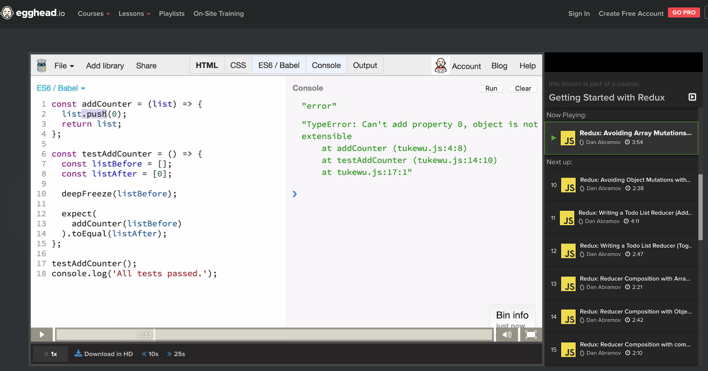
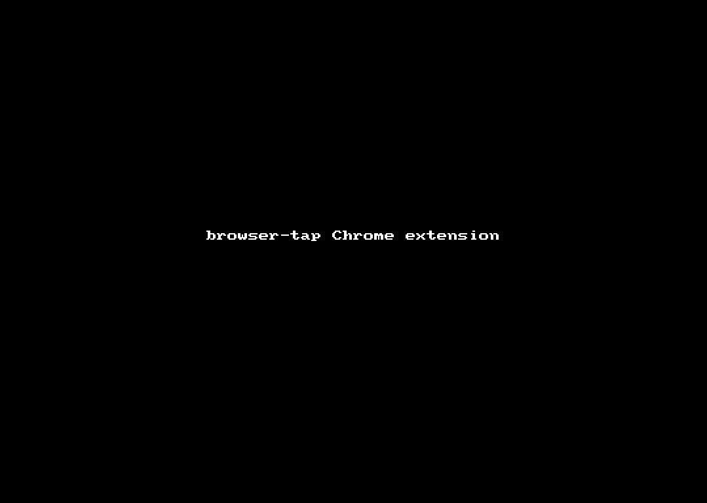

# Frictionless unit testing in javascript with Browser-TAP

**TL;DR:**

This article explains how to make your unit test setup and workflow as simple as possible (assuming you use [`babel`](https://babeljs.io/)).

Key ideas:

* test code is regular code
* tests run in the browser every time you build your app, just like regular code
* ditch them automatically for production builds
* use a Chrome Extension to control execution and improved display of results
* CI mode comes for free

Checkout this [example](https://github.com/ArnaudRinquin/browser-tap/example) or watch me [talk about it](http://bit.ly/browser-tap-talk) at #londonreact.


## Motivations

**Current developer experience around testing sucks.**

Tooling is too bulky and workflow is unappealing.

The test runners we use are big systems that are really hard to integrate properly in our already complex toolchains.

Once it's done, the workflow is overly complex and usually slow.

### The probable workflow

Setting up a `build` pipeline is becoming simpler everyday. My current favorite solution is to use `webpack` + `babel`. You can get a lot of stuff running in a matter of minutes:

* module packaging
* ES6 transpiling
* watch mode
* sourcemaps
* a dev server (with `webpack-dev-server`)
* minification
* event css

But then you want to integrate your unit testing solution and the problems arise:

* the test runner will run in another process
* you will need to compile another bundle for your tests
* your tests will probably run in a:
  * different browser (`karma + chrome-loader`)
  * a fake and issue riddled one (`phantomjs`)
  * node environment with a virtual DOM (`mocha + jsdom`)
* how do you run that in continuous integration?
* debugging becomes hell
  * no or poor sourcemaps support
  * no debugger
  * console.log driven debug

## The desirable workflow

While learning from [Dan Abramov demoing (and live re-implementing!) redux in jsbin](https://egghead.io/lessons/javascript-redux-writing-a-counter-reducer-with-tests), I loved how he simply writes tests just below the code.



The whole app, `code + tests` is compiled on save and thrown in the browser, tests results are shown in the console.

This workflow is actually really easy to setup:

1. simply run `webpack-dev-server`
 * code recompiled on save
 * live-reload included
1. Use a browser-friendly test framework like `tape`
1. Write tests along the code, self-documenting it
1. See the results in your regular browser console
1. Use your regular debug-tools

This setup does the job, is efficient and takes 10 minutes to setup.

Isn't it just great?

Well, not exactly. Now we need to do 3 more things:

1. Get rid of the test code for production
1. Keep the app usable while the tests are running
1. Run the tests in continuous integration

Can we fix them? _YES WE CAN!_
Is it hard? _It should take 5 minutes, top_

## Wipe out the test code for production

This task is much simpler that it seems. It takes two steps:

1. `npm install -D babel-plugin-discard-module-references`
1. Copy and adapt this blob in your `.babelrc`
  ```json
  {
      "presets": ["es2015"],
      "env": {
          "production": {
              "plugins": [
                  ["discard-module-references", {
                      "targets": [ "tape" ]
                  }]
              ]
          }
      }
  }
  ```

That's it.

Now, if `NODE_ENV` is set to `production` (ie. your run `NODE_ENV=production webpack`), all code related to `tape` will be dropped.

This:

```js
import test from 'tape';
import expect from 'expect';

export default function noop(anything) {
  return anything;
}

test('noop', function(t){
  // I should just use t.equal here but that's an example
  expect(noop()).toBe(undefined);

  t.equal(noop('something'), 'something');
  t.end();
});
```

Becomes this:

```js
export default function noop(anything) {
  return anything;
}
```

As you might notice, the `expect` module has been dropped has well. Even if it's not directly targeted by the config, it is dropped has the import is not used anymore.

Of course, you can whitelist modules so there are never removed.

More details on [`babel-plugin-discard-module-references` github repo](https://github.com/ArnaudRinquin/babel-plugin-discard-module-references)

## A nice UI for the results that gives you control

If you run `tape` code in the browser just like that you'll get a [TAP](https://testanything.org/) output in the console.

```
TAP version 13
# <Foo />
ok 1 has a clickable button
# <MyComponent />
ok 2 renders three <Foo /> components
ok 3 renders an `.icon-star`
ok 4 renders children when passed in

1..4
# tests 4
# pass  4

# ok
```

It's not super fancy but it gets the job done.

Now, a better option is to use [`browser-tap`](https://github.com/ArnaudRinquin/browser-tap) instead. It's just a 3 lines wrapper around `tape`. The only different is that it will look for `window.tapExtension`. If it is defined, it will delegate everything to that extension. If it doesn't it will just return `tape` and it will work just as well.

This really simple hack lets us delegate the tests execution and display to a Chrome Extension (or anything you can imagine).

So now, simply install the `browser-tap` extension and enjoy this awesome UI:



What you get:

* A new tab in the Chrome Devtools
* Nicely displayed test results
* Control over the test execution
  * switch them off, useful if you want to use your app without waiting
  * (re)start them manually
  * throttled execution (`TODO`)
* Desktop notifications (off / always / on error)
* A status icon with a badge

The only cost if you are already using `tape` is a search and replace to import `browser-tap` instead of `tape`. If you are using `webpack` it's even easier, simply use [`webpack resolve.alias`](https://webpack.github.io/docs/configuration.html#resolve-alias) feature:

```js
{
  // webpack.config.js
  resolve: {
    alias: {
      tape: 'browser-tap',
    },
  },
}
```

## Continuous integration _(almost)_ for **FREE**!

Cherry on the cake, Continuous Integration mode comes for the cost of 3 copy-pastings:

Step one

```sh
npm install -D browser-run tap-spec
```

Step two

```js
{
  // package.json, please adapt the path to your `index.html`
  "scripts": {
    "pretest": "NODE_ENV=ci webpack",
    "test": "cat public/index.html | browser-run --input html --static ./public | tap-spec"
  }
}
```

Step three

```js
// anywhere in your code, the root file seems like a good plan
if(process.env.NODE_ENV === 'ci') {
    test.onFinish(function(){
        window.close();
    });
}
```

Now simply run `npm test`. The whole application is thrown into `electron` and you get the results right in the shell, with a proper exit code.

```
npm test

> browser-tap-example@0.0.0 pretest /Users/arnaud/projects/browser-tap/example
> NODE_ENV=ci webpack

# blah blah

> browser-tap-example@0.0.0 test /Users/arnaud/projects/browser-tap/example
> cat public/index.html | browser-run --input html --static ./public | tap-spec

 <Foo />

   ✔ has a clickable button

 <MyComponent />

   ✔ renders three <Foo /> components
   ✔ renders an `.icon-star`
   ✔ renders children when passed in


 total:     4
 passing:   4
 duration:  2s
```

## Quick summary

Simply using `tape + babel + a Chrome extension`, we have:

* removed the need for a complex and slow test runner
* code + test living together in the same file
  * the simplest way to write tests
  * the purest way document your code
  * incentive to write tests
* tests that run in actual browsers, any of them
* your familiar debugging tools available, even for tests
* a fancy UI that gives you control over the tests
  * 3 clicks install, once
  * right next to your usual dev-tools
* a Continuous Integration mode that works

## Outro

I think the reason our test environment got so complicated is because we've lost track of what tests and test frameworks actually are.

We assume they must be complex blackboxes doing super clever things. They don't have to.

Let's try and forget our assumptions regarding unit tests tooling.

Tests are small bits of code checking stuff and throwing exceptions.

Test framework collect the exceptions and summarize the results.

I think the few ideas presented here are a good start, but we can probably simplify further.

What do you think?
